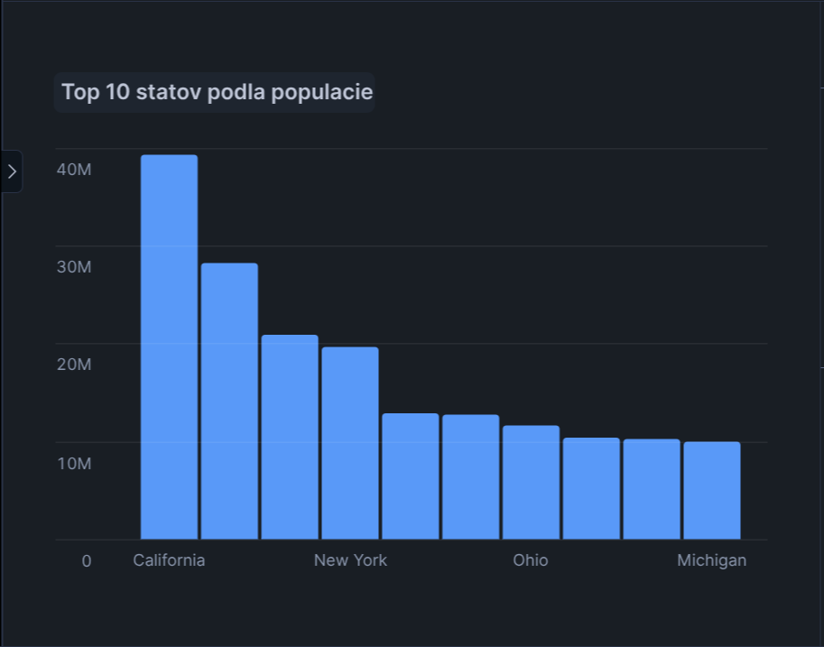
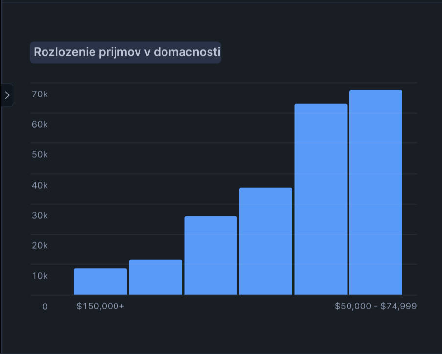
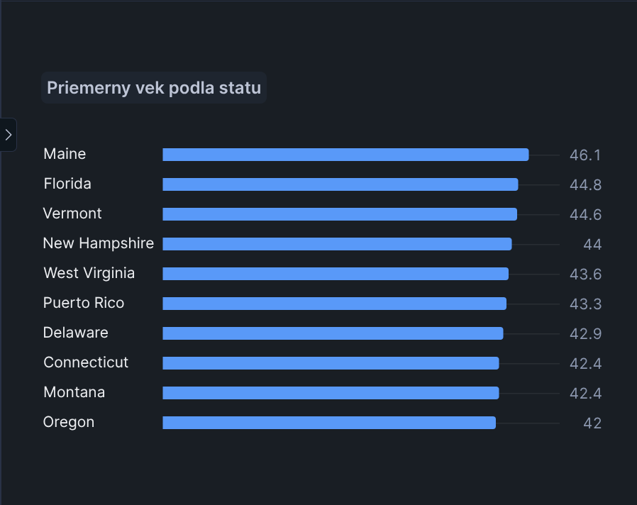
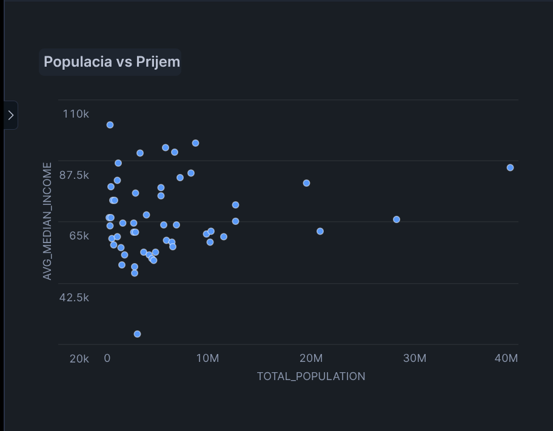
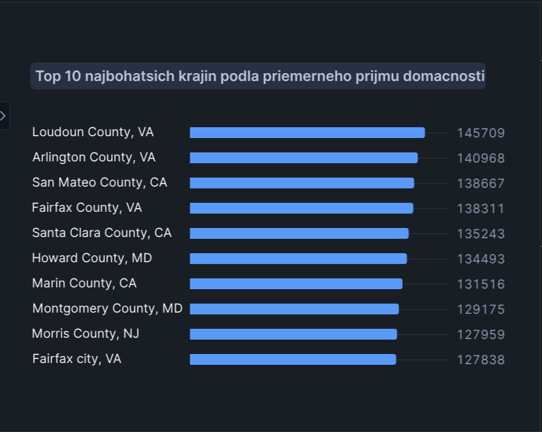

# US Census Demographics - ETL Project

Tento projekt analyzuje demograficke data z US Census pomocou ETL procesu v Snowflake. Data pochádzaju z datasetu **SafeGraph - US Open Census Data & Neighborhood Insights** dostupneho cez Snowflake Marketplace.

## 1. Uvod a popis zdrojovych dat

Cielom projektu je analyzovat demograficke udaje obyvatelstva USA na urovni Census Block Groups (CBG). Projekt vyuziva data z American Community Survey (ACS) 2019 5-Year Estimates.

### Zdrojova databaza
- **Snowflake Database**: `US_OPEN_CENSUS_DATA__NEIGHBORHOOD_INSIGHTS__FREE_DATASET`
- **Schema**: `PUBLIC`
- **Warehouse**: `COBRA_WH`

### Zdrojove tabulky

| Tabulka | Popis | Pocet riadkov |
|---------|-------|---------------|
| `2019_CBG_B01` | Pohlavie a vek | 220,333 |
| `2019_CBG_B19` | Prijem domacnosti | 220,333 |
| `2019_METADATA_CBG_FIPS_CODES` | FIPS kody statov a counties | 3,233 |
| `2019_METADATA_CBG_GEOGRAPHIC_DATA` | Geograficke data (lat/lng) | 220,333 |

### Struktura CENSUS_BLOCK_GROUP ID

```
CENSUS_BLOCK_GROUP = "010010201001"
                      ││││││││││││
                      ││││││││└┴┴┴── Block Group (4 digits)
                      ││││││└┴────── Tract (6 digits)
                      │││└┴┴──────── County FIPS (3 digits)
                      └┴──────────── State FIPS (2 digits)
```

### Klucove Census kody

| Kod | Popis |
|-----|-------|
| B01001e1 | Total Population |
| B01002e1 | Median Age |
| B01001e2 | Male Population |
| B01001e26 | Female Population |
| B19013e1 | Median Household Income |
| B19001e2-e17 | Income brackets |

---

## 2. ERD Diagram

ERD diagram zobrazuje vztahy medzi zdrojovymi tabulkami v povodnej databaze SafeGraph.

<p align="center">
  
  <br>
  <em>Obrazok 1: Entity-Relationship Diagram zdrojovych dat</em>
</p>

---

## 3. Star Schema

Star schema navrhnuty pre analyzu demografickych dat obsahuje 1 faktovu tabulku a 4 dimenzie (vsetky SCD Type 0).

<p align="center">
  
  <br>
  <em>Obrazok 2: Star Schema dimenzionalneho modelu</em>
</p>

### Dimenzie

| Dimenzia | Typ SCD | Popis | Pocet riadkov |
|----------|---------|-------|---------------|
| `dim_state` | SCD Type 0 | Staty USA | ~52 |
| `dim_county` | SCD Type 0 | Counties | ~3,233 |
| `dim_income_bracket` | SCD Type 0 | Prijmove kategorie | 16 |
| `dim_age_group` | SCD Type 0 | Vekove skupiny | 12 |

### Faktova tabulka

| Tabulka | Popis | Pocet riadkov |
|---------|-------|---------------|
| `fact_demographics` | Demograficke metriky na urovni CBG | ~217,000 |

---

## 4. ETL Proces

### 4.1 Extract (Staging)

Extrahovanie dat zo zdrojovych tabuliek do staging vrstvy:

```sql
-- Staging: Population & Age
CREATE OR REPLACE TABLE stg_population AS
SELECT
    CENSUS_BLOCK_GROUP,
    B01001e1 AS total_population,
    B01001e2 AS male_population,
    B01001e26 AS female_population,
    B01002e1 AS median_age
FROM US_OPEN_CENSUS_DATA__NEIGHBORHOOD_INSIGHTS__FREE_DATASET.PUBLIC."2019_CBG_B01";

-- Staging: Income
CREATE OR REPLACE TABLE stg_income AS
SELECT
    CENSUS_BLOCK_GROUP,
    B19013e1 AS median_household_income,
    B19001e1 AS total_households
FROM US_OPEN_CENSUS_DATA__NEIGHBORHOOD_INSIGHTS__FREE_DATASET.PUBLIC."2019_CBG_B19";
```

### 4.2 Transform (Dimenzie)

Vytvorenie dimenzionalnych tabuliek:

```sql
-- Dimenzia: DIM_STATE (SCD Type 0)
CREATE OR REPLACE TABLE dim_state AS
SELECT
    ROW_NUMBER() OVER (ORDER BY STATE_FIPS) AS state_id,
    STATE_FIPS AS state_fips,
    STATE AS state_abbr,
    CASE STATE
        WHEN 'CA' THEN 'California'
        WHEN 'TX' THEN 'Texas'
        -- ... dalsie staty
    END AS state_name
FROM stg_fips
GROUP BY STATE_FIPS, STATE;

-- Dimenzia: DIM_COUNTY (SCD Type 0)
CREATE OR REPLACE TABLE dim_county AS
SELECT
    ROW_NUMBER() OVER (ORDER BY f.STATE_FIPS, f.COUNTY_FIPS) AS county_id,
    f.STATE_FIPS || f.COUNTY_FIPS AS county_fips_full,
    f.COUNTY AS county_name,
    s.state_id
FROM stg_fips f
JOIN dim_state s ON f.STATE_FIPS = s.state_fips;
```

### 4.3 Load (Faktova tabulka s Window Functions)

Vytvorenie faktovej tabulky s vyuzitim window functions:

```sql
CREATE OR REPLACE TABLE fact_demographics AS
SELECT
    ROW_NUMBER() OVER (ORDER BY cbg_id) AS fact_id,
    b.cbg_id,
    s.state_id,
    c.county_id,
    b.total_population,
    b.median_age,
    b.median_household_income,

    -- WINDOW FUNCTIONS
    -- 1. RANK() - Poradie podla populacie v ramci statu
    RANK() OVER (
        PARTITION BY s.state_id
        ORDER BY b.total_population DESC
    ) AS population_rank_in_state,

    -- 2. PERCENT_RANK() - Percentil prijmu celonarodne
    ROUND(PERCENT_RANK() OVER (
        ORDER BY b.median_household_income NULLS FIRST
    ), 4) AS income_percentile,

    -- 3. SUM() OVER - Kumulativna populacia
    SUM(b.total_population) OVER (
        PARTITION BY s.state_id
        ORDER BY b.cbg_id
        ROWS BETWEEN UNBOUNDED PRECEDING AND CURRENT ROW
    ) AS cumulative_pop_in_state,

    -- 4. AVG() OVER - Priemer prijmu v county
    ROUND(AVG(b.median_household_income) OVER (
        PARTITION BY c.county_id
    ), 0) AS avg_income_in_county

FROM base_data b
JOIN dim_state s ON b.state_fips = s.state_fips
JOIN dim_county c ON b.county_fips_full = c.county_fips_full;
```

---

## 5. Vizualizacie

### 5.1 Top 10 statov podla populacie

```sql
SELECT
    s.state_name,
    SUM(f.total_population) AS total_population,
    COUNT(f.cbg_id) AS num_block_groups,
    ROUND(AVG(f.median_age), 1) AS avg_median_age
FROM fact_demographics f
JOIN dim_state s ON f.state_id = s.state_id
GROUP BY s.state_name
ORDER BY total_population DESC
LIMIT 10;
```

<p align="center">
  
  <br>
  <em>Graf 1: Top 10 statov podla celkovej populacie</em>
</p>

**Interpretacia:** California, Texas a Florida su najludnatejsie staty USA. California ma vyrazne viac obyvatelov ako ostatne staty, co reflektuje jej ekonomicky vyznam a rozlohu.

---

### 5.2 Distribucia prijmu

```sql
SELECT
    ib.bracket_label,
    ib.income_bracket_id,
    COUNT(f.cbg_id) AS num_block_groups,
    SUM(f.total_population) AS total_population
FROM fact_demographics f
JOIN dim_income_bracket ib ON f.income_bracket_id = ib.income_bracket_id
GROUP BY ib.bracket_label, ib.income_bracket_id
ORDER BY ib.income_bracket_id;
```

<p align="center">
  
  <br>
  <em>Graf 2: Distribucia prijmu domacnosti v USA</em>
</p>

**Interpretacia:** Vacsina oblastí ma stredne az vyssie prijmy. Kategorie $50,000 - $100,000 su najcastejsie, co naznacuje silnu strednu triedu v USA. Vysoke prijmy nad $200,000 su koncentrovane v mensine oblastí.

---

### 5.3 Priemerny vek podla statu

```sql
SELECT
    s.state_name,
    ROUND(AVG(f.median_age), 1) AS avg_median_age,
    MIN(f.median_age) AS min_age,
    MAX(f.median_age) AS max_age
FROM fact_demographics f
JOIN dim_state s ON f.state_id = s.state_id
GROUP BY s.state_name
ORDER BY avg_median_age DESC;
```

<p align="center">
  
  <br>
  <em>Graf 3: Priemerny medianovy vek podla statu</em>
</p>

**Interpretacia:** Maine, Florida a Vermont maju najvyssí priemerny vek, co suvisí s vysokym podielom dochodcov (Florida ako destinacia pre seniorov). Utah ma naopak najmladšiu populaciu kvoli vysokej porodnosti.

---

### 5.4 Prijem vs Populacia (Scatter plot)

```sql
SELECT
    s.state_name,
    SUM(f.total_population) AS total_population,
    ROUND(AVG(f.median_household_income), 0) AS avg_median_income
FROM fact_demographics f
JOIN dim_state s ON f.state_id = s.state_id
GROUP BY s.state_name
ORDER BY total_population DESC;
```

<p align="center">
  
  <br>
  <em>Graf 4: Vztah medzi populaciou a priemernym prijmom statov</em>
</p>

**Interpretacia:** Nie je priamy vztah medzi velkostou statu a priemernym prijmom. Male staty ako Maryland a Massachusetts maju vyssie prijmy ako velke staty. Najludnatejsie staty (CA, TX, FL) maju rozne urovne prijmu.

---

### 5.5 Top 10 counties podla prijmu

```sql
SELECT
    c.county_name,
    s.state_abbr,
    ROUND(AVG(f.median_household_income), 0) AS avg_median_income,
    SUM(f.total_population) AS total_population,
    COUNT(f.cbg_id) AS num_block_groups
FROM fact_demographics f
JOIN dim_county c ON f.county_id = c.county_id
JOIN dim_state s ON c.state_id = s.state_id
WHERE f.median_household_income IS NOT NULL
GROUP BY c.county_name, s.state_abbr
HAVING COUNT(f.cbg_id) >= 10
ORDER BY avg_median_income DESC
LIMIT 10;
```

<p align="center">
  
  <br>
  <em>Graf 5: Top 10 najbohatších counties v USA</em>
</p>

**Interpretacia:** Loudoun County (VA), Falls Church (VA) a Arlington County (VA) su najbohatšie oblasti v USA, vsetky v blizkosti Washingtonu D.C. Toto reflektuje vysoke platy vo vladnom a technologickom sektore v okoli hlavneho mesta.

---

## Autor

**Adam Buranský**

Projekt vytvoreny v ramci predmetu Databazove technologie, januar 2026.
