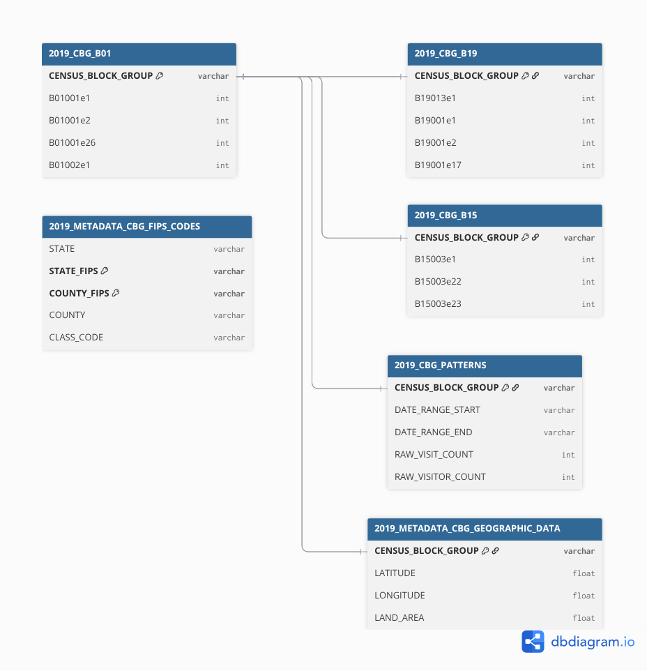
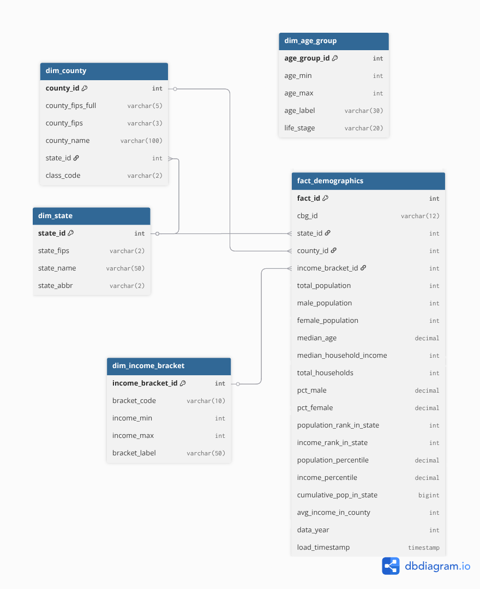

# US Census Demographics - ETL Project

Tento projekt analyzuje demograficke data z US Census pomocou ETL procesu v Snowflake. Data pochádzaju z datasetu **SafeGraph - US Open Census Data & Neighborhood Insights** dostupneho cez Snowflake Marketplace.

## 1. Uvod a popis zdrojovych dat

Cielom projektu je analyzovat demograficke udaje obyvatelstva USA na urovni Census Block Groups (CBG). Projekt vyuziva data z American Community Survey (ACS) 2019 5-Year Estimates.

### Zdrojova databaza
- **Snowflake Database**: `US_OPEN_CENSUS_DATA__NEIGHBORHOOD_INSIGHTS__FREE_DATASET`
- **Schema**: `PUBLIC`
- **Warehouse**: `COBRA_WH`

### Zdrojove tabulky

| Tabulka | Popis | Pocet riadkov |
|---------|-------|---------------|
| `2019_CBG_B01` | Pohlavie a vek | 220,333 |
| `2019_CBG_B19` | Prijem domacnosti | 220,333 |
| `2019_METADATA_CBG_FIPS_CODES` | FIPS kody statov a counties | 3,233 |
| `2019_METADATA_CBG_GEOGRAPHIC_DATA` | Geograficke data (lat/lng) | 220,333 |

### Struktura CENSUS_BLOCK_GROUP ID

```
CENSUS_BLOCK_GROUP = "010010201001"
                      ││││││││││││
                      ││││││││└┴┴┴── Block Group (4 digits)
                      ││││││└┴────── Tract (6 digits)
                      │││└┴┴──────── County FIPS (3 digits)
                      └┴──────────── State FIPS (2 digits)
```

### Klucove Census kody

| Kod | Popis |
|-----|-------|
| B01001e1 | Total Population |
| B01002e1 | Median Age |
| B01001e2 | Male Population |
| B01001e26 | Female Population |
| B19013e1 | Median Household Income |
| B19001e2-e17 | Income brackets |

---

## 2. ERD Diagram

ERD diagram zobrazuje vztahy medzi zdrojovymi tabulkami v povodnej databaze SafeGraph.

<p align="center">
  
  <br>
  <em>Obrazok 1: Entity-Relationship Diagram zdrojovych dat</em>
</p>

---

## 3. Star Schema

Star schema navrhnuty pre analyzu demografickych dat obsahuje 1 faktovu tabulku a 4 dimenzie (vsetky SCD Type 0).

<p align="center">
  
  <br>
  <em>Obrazok 2: Star Schema dimenzionalneho modelu</em>
</p>

### Dimenzie

| Dimenzia | Typ SCD | Popis | Pocet riadkov |
|----------|---------|-------|---------------|
| `dim_state` | SCD Type 0 | Staty USA | ~52 |
| `dim_county` | SCD Type 0 | Counties | ~3,233 |
| `dim_income_bracket` | SCD Type 0 | Prijmove kategorie | 16 |
| `dim_age_group` | SCD Type 0 | Vekove skupiny | 12 |

### Faktova tabulka

| Tabulka | Popis | Pocet riadkov |
|---------|-------|---------------|
| `fact_demographics` | Demograficke metriky na urovni CBG | ~217,000 |
